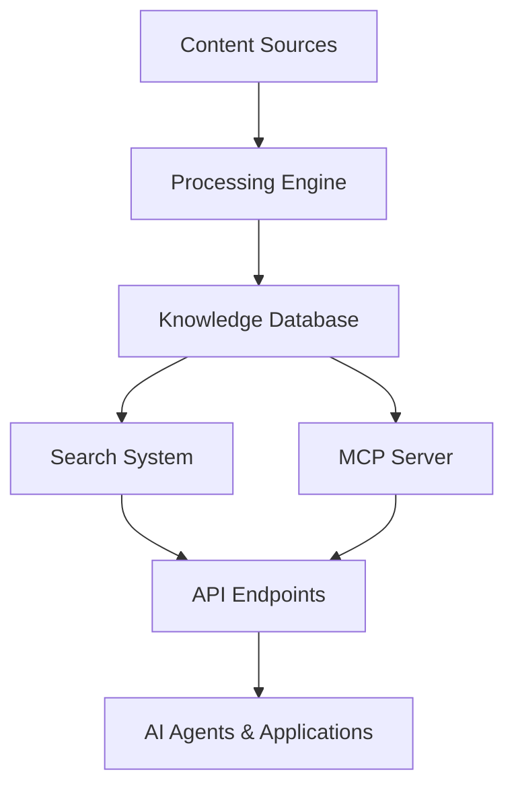

# Creatio AI Knowledge Hub - Documentation

Welcome to the comprehensive documentation for the Creatio AI Knowledge Hub. This system provides AI-powered content processing, semantic search, and Model Context Protocol (MCP) server integration for Creatio Academy content.

## 📚 Documentation Structure

### Core Components
- [**AI Knowledge Hub**](components/ai-knowledge-hub.md) - Main processing engine and MCP server
- [**Video Processing**](components/video-processing.md) - Video download, transcription, and analysis
- [**Content Processing**](components/content-processing.md) - Document processing and indexing
- [**Search System**](components/search-system.md) - Semantic and faceted search capabilities
- [**Database Management**](components/database-management.md) - Knowledge base organization

### Setup & Administration
- [**Quick Start Guide**](setup/quick-start.md) - Get running in 5 minutes
- [**Installation Guide**](setup/installation.md) - Complete setup instructions
- [**Configuration**](setup/configuration.md) - System configuration options
- [**Troubleshooting**](setup/troubleshooting.md) - Common issues and solutions

### Developer Resources
- [**API Reference**](api/README.md) - Complete API documentation
- [**Architecture Overview**](architecture/README.md) - System architecture diagrams
- [**Command Reference**](commands/README.md) - All available commands
- [**Contributing Guide**](development/contributing.md) - How to contribute

## 🚀 Quick Navigation

### For Users
- **New to the system?** → [Quick Start Guide](setup/quick-start.md)
- **Need help?** → [Troubleshooting Guide](setup/troubleshooting.md)
- **Looking for specific commands?** → [Command Reference](commands/README.md)

### For Developers
- **Understanding the system?** → [Architecture Overview](architecture/README.md)
- **Building integrations?** → [API Reference](api/README.md)
- **Contributing code?** → [Development Guide](development/README.md)

### For Administrators
- **Setting up the system?** → [Installation Guide](setup/installation.md)
- **Configuring components?** → [Configuration Guide](setup/configuration.md)
- **Monitoring performance?** → [Operations Guide](operations/README.md)

## 📊 System Overview

The Creatio AI Knowledge Hub consists of several interconnected components:

## 🔧 Key Features

- **🎥 Video Intelligence**: Complete video processing with transcription and analysis
- **📚 Content Processing**: Automated content extraction and indexing
- **🔍 Advanced Search**: Semantic search with multi-dimensional filtering
- **🤖 AI Integration**: MCP server for seamless AI agent interaction
- **📊 Analytics**: Content insights and processing metrics
- **🔧 Extensible**: Modular architecture for easy customization

## 📈 Getting Started

1. **Quick Setup**: Follow the [Quick Start Guide](setup/quick-start.md) for immediate access
2. **Explore Components**: Check out individual [component documentation](components/)
3. **Try the API**: Review the [API Reference](api/README.md) for integration
4. **Understand Architecture**: Read the [Architecture Overview](architecture/README.md)

## 🆘 Support

- **Documentation Issues**: Check the [troubleshooting guide](setup/troubleshooting.md)
- **Feature Requests**: See the [contributing guide](development/contributing.md)
- **Technical Questions**: Review the [FAQ section](setup/faq.md)

---

**Version**: 1.0.0 | **Last Updated**: 2025-01-27 | **License**: MIT
