# Architecture Overview

This document provides a comprehensive overview of the Creatio AI Knowledge Hub
architecture, including system components, data flow, and integration patterns.

## System Architecture

### High-Level Architecture

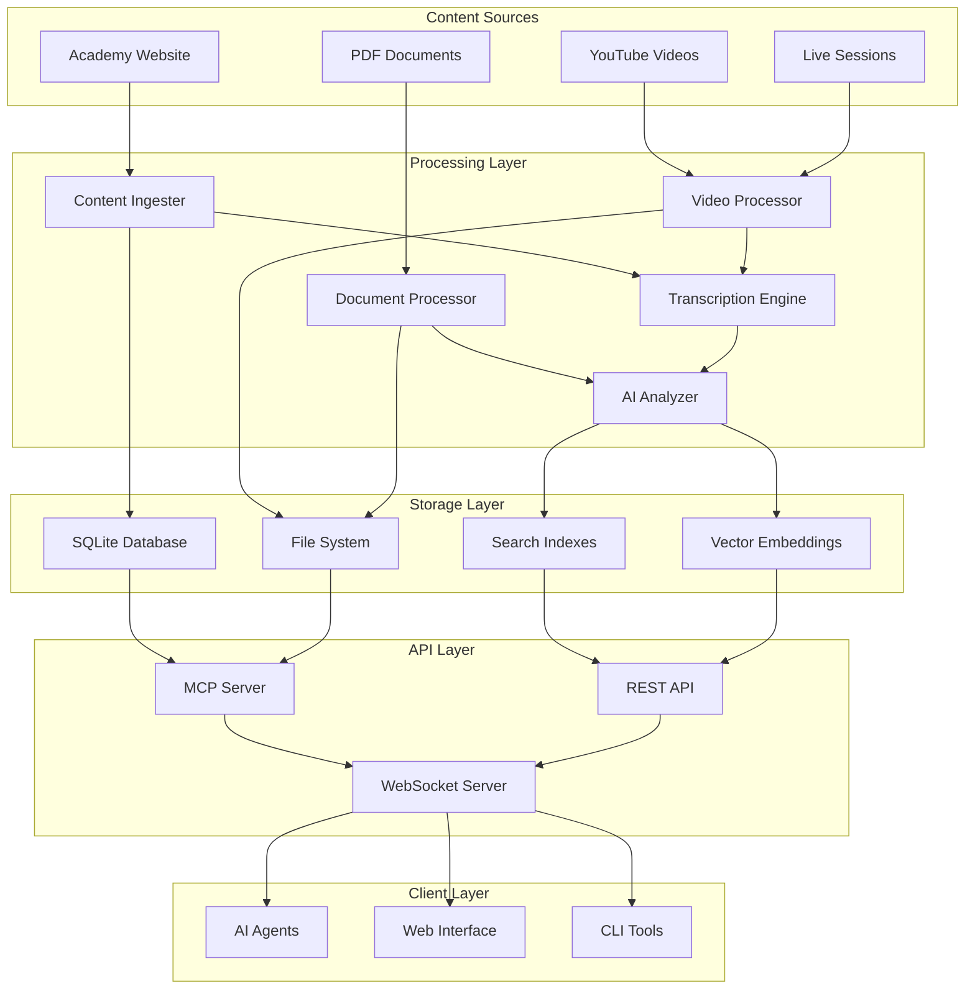

## Component Architecture

### Processing Pipeline

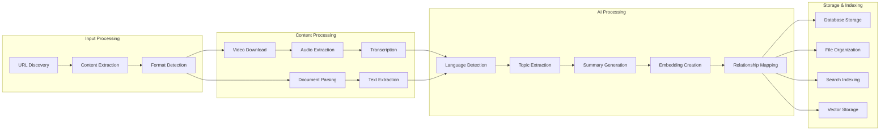

### MCP Server Architecture

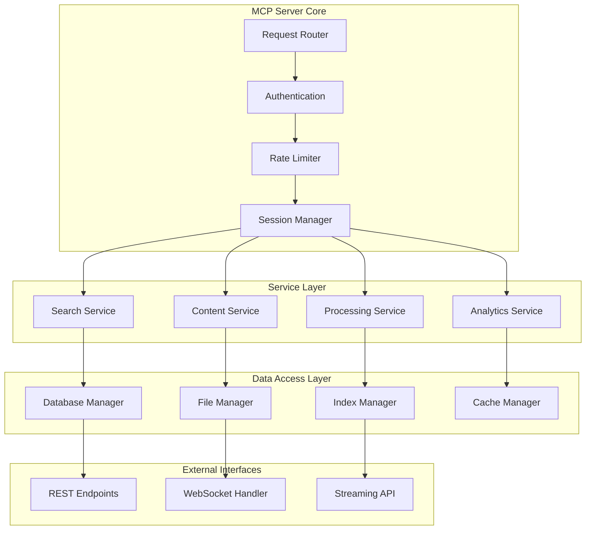

## Data Flow Architecture

### Content Processing Flow

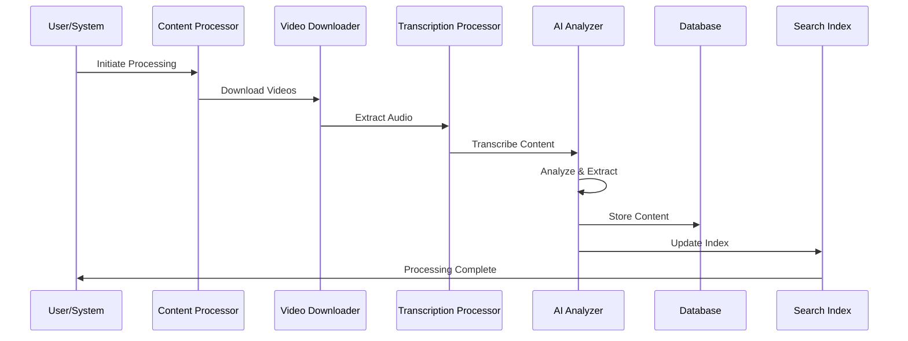

### Search Query Flow

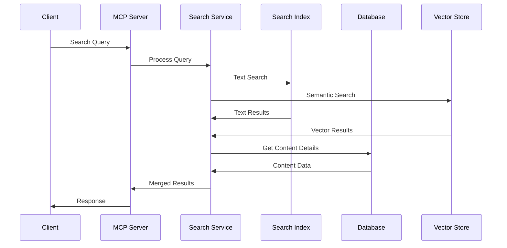

## Component Details

### 1. Content Ingestion Layer

**Components:**

- **Web Crawler**: Discovers and downloads web content
- **Video Downloader**: Handles YouTube and direct video downloads
- **Document Processor**: Processes PDFs and other documents
- **Metadata Extractor**: Extracts structured metadata

**Technologies:**

- Python requests/aiohttp for web crawling
- yt-dlp for video downloading
- PyPDF2/pdfplumber for document processing
- BeautifulSoup for HTML parsing

### 2. Processing Layer

**Components:**

- **Transcription Engine**: OpenAI Whisper for audio-to-text
- **AI Analyzer**: GPT models for content analysis
- **Topic Extractor**: Machine learning for topic identification
- **Summary Generator**: Automated content summarization

**Technologies:**

- OpenAI Whisper for transcription
- Transformers library for NLP tasks
- spaCy for text processing
- scikit-learn for clustering

### 3. Storage Layer

**Components:**

- **SQLite Database**: Structured data storage
- **File System**: Raw content and media storage
- **Search Indexes**: Full-text search capabilities
- **Vector Store**: Semantic embeddings storage

**Schema Design:**

```sql
-- Core content table
CREATE TABLE content (
    id TEXT PRIMARY KEY,
    title TEXT NOT NULL,
    type TEXT NOT NULL,
    source TEXT NOT NULL,
    content TEXT,
    metadata JSON,
    created_at DATETIME,
    updated_at DATETIME
);

-- Vector embeddings table
CREATE TABLE embeddings (
    content_id TEXT,
    embedding BLOB,
    model TEXT,
    FOREIGN KEY (content_id) REFERENCES content(id)
);

-- Search index table
CREATE TABLE search_index (
    id INTEGER PRIMARY KEY,
    content_id TEXT,
    tokens TEXT,
    rank REAL,
    FOREIGN KEY (content_id) REFERENCES content(id)
);
```

### 4. API Layer

**Components:**

- **REST API**: Standard HTTP endpoints
- **WebSocket Server**: Real-time communication
- **MCP Protocol**: Model Context Protocol implementation
- **Streaming API**: Large response streaming

**Endpoints:**

```python
# Search endpoints
GET /mcp/search?q={query}&type={type}&limit={limit}
POST /mcp/search/advanced

# Content endpoints
GET /mcp/content/{id}
POST /mcp/content/batch

# Processing endpoints
POST /mcp/process/video
POST /mcp/process/document

# Analytics endpoints
GET /mcp/analytics/stats
GET /mcp/analytics/usage
```

## Scalability Considerations

### Horizontal Scaling

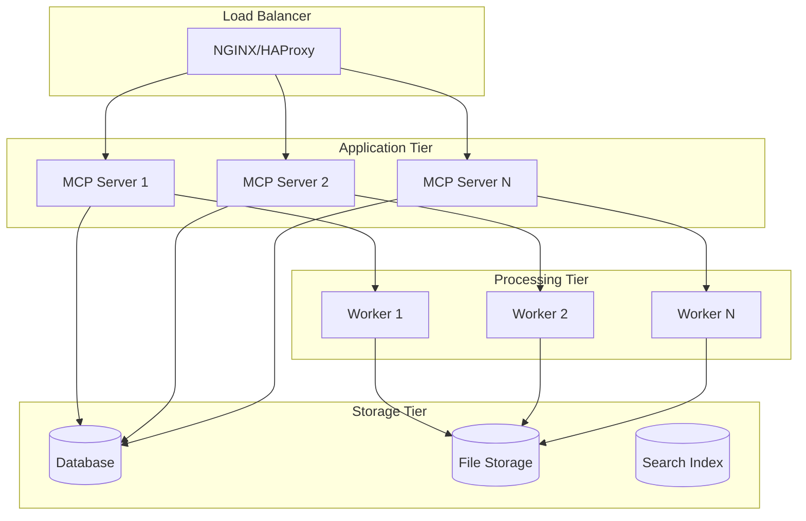

### Performance Optimization

**Caching Strategy:**

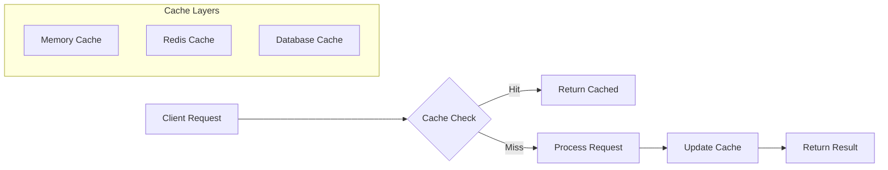

## Security Architecture

### Authentication & Authorization

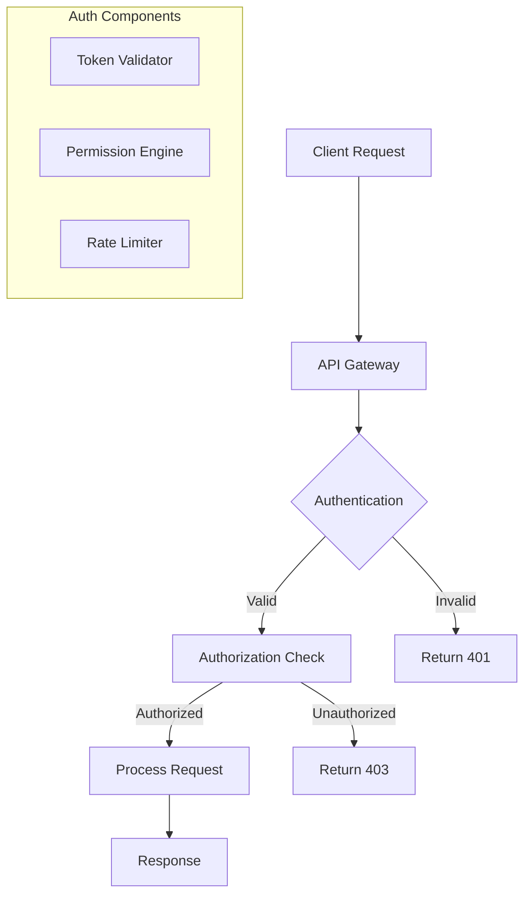

### Data Protection

**Encryption at Rest:**

- Database encryption using SQLite encryption extensions
- File system encryption for sensitive content
- Vector embeddings protection

**Encryption in Transit:**

- TLS/SSL for all API communications
- WebSocket secure connections (WSS)
- Certificate management

## Monitoring Architecture

### Observability Stack

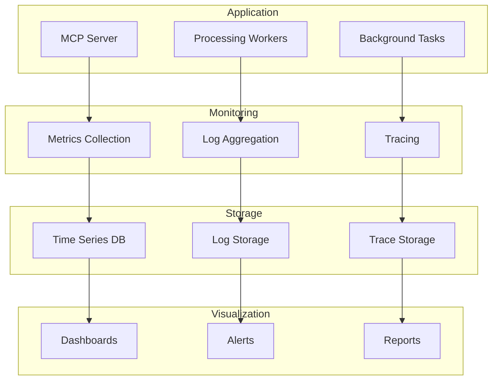

## Deployment Architecture

### Container Architecture

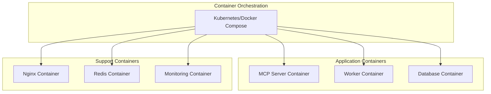

### Environment Configuration

```yaml
# docker-compose.yml
version: '3.8'
services:
  mcp-server:
    build: .
    ports:
      - '8000:8000'
    environment:
      - DATABASE_URL=sqlite:///data/knowledge_hub.db
      - REDIS_URL=redis://redis:6379
    volumes:
      - ./data:/app/data
      - ./logs:/app/logs

  worker:
    build: .
    command: python -m ai_knowledge_hub.worker
    volumes:
      - ./data:/app/data
      - ./videos:/app/videos

  redis:
    image: redis:alpine
    ports:
      - '6379:6379'

  nginx:
    image: nginx:alpine
    ports:
      - '80:80'
    volumes:
      - ./nginx.conf:/etc/nginx/nginx.conf
```

## Future Architecture Considerations

### Microservices Migration

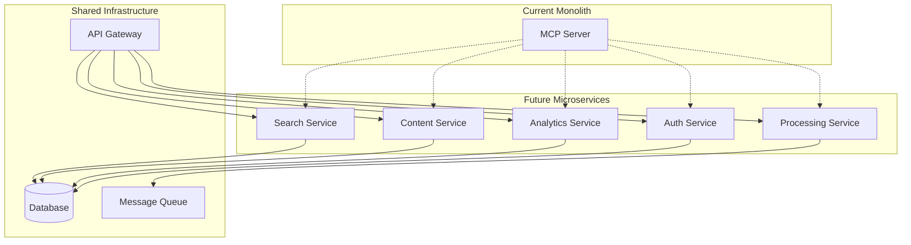

### Cloud-Native Architecture

**AWS Implementation:**

- ECS/EKS for container orchestration
- RDS for managed database
- S3 for file storage
- ElasticSearch for search
- Lambda for serverless processing

**Azure Implementation:**

- AKS for Kubernetes
- CosmosDB for database
- Blob Storage for files
- Cognitive Search for search
- Functions for serverless

---

This architecture documentation provides the foundation for understanding,
maintaining, and extending the Creatio AI Knowledge Hub system. For
implementation details, see the individual component documentation.
