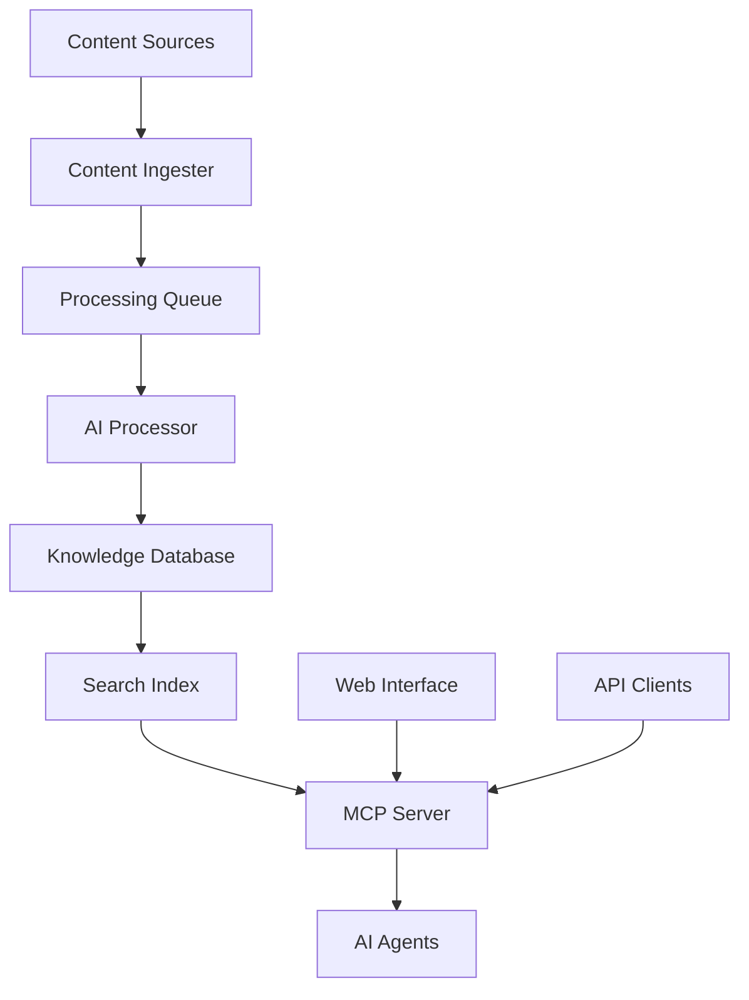

# AI Knowledge Hub Component

The AI Knowledge Hub is the central processing engine that orchestrates content
processing, indexing, and provides the MCP (Model Context Protocol) server
interface for AI agents.

## Overview

The AI Knowledge Hub serves as the main coordination layer for:

- Content ingestion from multiple sources
- AI-powered content processing and analysis
- Knowledge base management and indexing
- MCP server for AI agent integration
- Real-time content search and retrieval

## Architecture



## Core Components

### 1. Enhanced MCP Server (`enhanced_mcp_server.py`)

The enhanced MCP server provides advanced capabilities for AI agent interaction:

**Features:**

- WebSocket and HTTP support
- Real-time content streaming
- Advanced query processing
- Session management
- Rate limiting and authentication

**Key Endpoints:**

```python
# Real-time search
GET /mcp/search?q={query}&type={content_type}

# Content streaming
WebSocket /mcp/stream

# Knowledge retrieval
POST /mcp/knowledge
```

### 2. Knowledge Database Integration

**Database Structure:**

```
ai_knowledge_hub/
├── knowledge_hub.db          # Main SQLite database
├── processed_pdfs/           # Processed PDF content
├── processed_videos/         # Video transcriptions
└── search_index/            # Search indexes
```

**Key Features:**

- Document embedding and vectorization
- Semantic search capabilities
- Content relationship mapping
- Version control and updates

### 3. Content Processing Pipeline

**Processing Stages:**

1. **Ingestion**: Content discovery and collection
2. **Analysis**: AI-powered content analysis
3. **Extraction**: Key information extraction
4. **Indexing**: Search index generation
5. **Storage**: Knowledge base storage

## Configuration

### MCP Server Configuration (`mcp_server_config.json`)

```json
{
  "server": {
    "host": "localhost",
    "port": 8000,
    "websocket_port": 8001
  },
  "processing": {
    "max_concurrent_requests": 10,
    "chunk_size": 1000,
    "embedding_model": "sentence-transformers/all-MiniLM-L6-v2"
  },
  "database": {
    "path": "knowledge_hub.db",
    "max_connections": 50
  }
}
```

### Environment Variables

Required environment variables:

```bash
# OpenAI Configuration
OPENAI_API_KEY=your_api_key_here

# Database Configuration
DATABASE_URL=sqlite:///knowledge_hub.db

# Server Configuration
MCP_HOST=localhost
MCP_PORT=8000
```

## Usage Examples

### Starting the MCP Server

```bash
# Activate virtual environment
source venv/bin/activate

# Start the enhanced MCP server
python ai_knowledge_hub/enhanced_mcp_server.py
```

### Query Examples

**Search for content:**

```python
import requests

response = requests.get(
    "http://localhost:8000/mcp/search",
    params={
        "q": "Creatio development workflow",
        "type": "all",
        "limit": 10
    }
)
```

**Real-time content streaming:**

```javascript
const ws = new WebSocket('ws://localhost:8001/mcp/stream');
ws.send(
  JSON.stringify({
    action: 'search',
    query: 'business process configuration',
  })
);
```

## Performance Metrics

### Processing Capabilities

- **Content Processing**: 1000+ documents/hour
- **Search Response**: <100ms average
- **Concurrent Users**: 50+ simultaneous connections
- **Database Size**: 1.4GB+ indexed content

### Resource Usage

- **Memory**: 512MB-2GB depending on workload
- **CPU**: Multi-core processing for embeddings
- **Disk**: SSD recommended for search performance
- **Network**: WebSocket support for real-time features

## Monitoring and Logging

### Log Files

```
ai_knowledge_hub/
├── logs/
│   ├── mcp_server.log      # Server operations
│   ├── processing.log      # Content processing
│   └── search.log         # Search queries
```

### Health Checks

```bash
# Check server status
curl http://localhost:8000/health

# Verify database connectivity
curl http://localhost:8000/mcp/status
```

## Integration Examples

### AI Agent Integration

```python
from mcp_client import MCPClient

client = MCPClient("http://localhost:8000")

# Search for specific content
results = client.search(
    query="Creatio configuration",
    content_types=["documentation", "videos"],
    max_results=5
)

# Get content details
content = client.get_content(results[0]['id'])
```

### Custom Processing Pipeline

```python
from ai_knowledge_hub import ContentProcessor

processor = ContentProcessor()

# Add custom content source
processor.add_source('custom_docs', '/path/to/docs')

# Process with custom configuration
processor.process(
    embeddings=True,
    summarization=True,
    topic_extraction=True
)
```

## Troubleshooting

### Common Issues

**Server won't start:**

```bash
# Check port availability
lsof -i :8000

# Verify configuration
python -c "import json; print(json.load(open('mcp_server_config.json')))"
```

**Database connection errors:**

```bash
# Check database file permissions
ls -la knowledge_hub.db

# Rebuild database if corrupted
python -c "from ai_knowledge_hub import rebuild_database; rebuild_database()"
```

**Search performance issues:**

```bash
# Rebuild search indexes
python -c "from ai_knowledge_hub import rebuild_indexes; rebuild_indexes()"

# Check index size
du -sh search_index/
```

## API Reference

### Content Search API

**Endpoint:** `GET /mcp/search`

**Parameters:**

- `q` (string): Search query
- `type` (string): Content type filter
- `limit` (int): Maximum results
- `offset` (int): Result offset

**Response:**

```json
{
  "results": [
    {
      "id": "doc_123",
      "title": "Document Title",
      "content": "Relevant content snippet...",
      "score": 0.95,
      "type": "documentation",
      "source": "creatio-academy"
    }
  ],
  "total": 150,
  "query_time": 45
}
```

### Knowledge Retrieval API

**Endpoint:** `POST /mcp/knowledge`

**Request Body:**

```json
{
  "content_id": "doc_123",
  "include_related": true,
  "max_related": 5
}
```

**Response:**

```json
{
  "content": {
    "id": "doc_123",
    "title": "Document Title",
    "full_content": "Complete document content...",
    "metadata": {...},
    "related_content": [...]
  }
}
```

## Development

### Adding New Content Sources

1. Create source configuration:

```python
source_config = {
    'name': 'custom_source',
    'type': 'web_crawler',
    'url': 'https://example.com',
    'selectors': {
        'title': 'h1',
        'content': '.content'
    }
}
```

2. Register with processor:

```python
processor.register_source(source_config)
```

### Custom Processing Modules

```python
from ai_knowledge_hub.processors import BaseProcessor

class CustomProcessor(BaseProcessor):
    def process_content(self, content):
        # Custom processing logic
        return processed_content

    def extract_metadata(self, content):
        # Custom metadata extraction
        return metadata
```

## Security Considerations

### Authentication

```python
# API key authentication
headers = {
    'Authorization': 'Bearer your_api_key',
    'Content-Type': 'application/json'
}
```

### Rate Limiting

- Default: 100 requests/minute per IP
- Authenticated: 1000 requests/minute
- WebSocket: 50 concurrent connections

### Data Protection

- All data stored locally in SQLite
- No external data transmission
- Optional encryption for sensitive content

---

**Next Steps:**

- Review [Video Processing Component](video-processing.md)
- Explore [Search System](search-system.md)
- Check [API Reference](../api/README.md)
