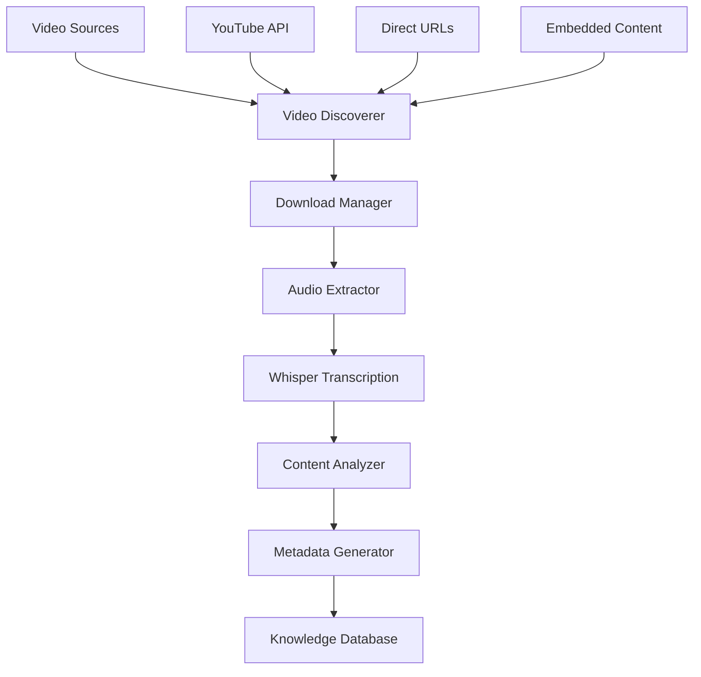

# Video Processing Component

The Video Processing Component handles comprehensive video content management including download, transcription, analysis, and integration with the knowledge base.

## Overview

This component provides:
- Automated video discovery and download
- AI-powered transcription using OpenAI Whisper
- Video content analysis and summarization
- Metadata extraction and organization
- Search index integration

## Architecture



## Key Components

### 1. Video Discovery

**Supported Sources:**
- YouTube videos (embedded and direct)
- Vimeo content
- Direct video file URLs (.mp4, .webm, .mov)
- iFrame embedded videos

**Discovery Process:**
```python
# Automatic video discovery from web pages
from video_processing import VideoDiscoverer

discoverer = VideoDiscoverer()
videos = discoverer.discover_from_url('https://academy.creatio.com')
```

### 2. Download Management

**Features:**
- Concurrent downloading with rate limiting
- Resume interrupted downloads
- Quality selection and format preferences
- Metadata preservation
- Thumbnail extraction

**Download Configuration:**
```json
{
  "download_settings": {
    "max_concurrent": 3,
    "preferred_quality": "720p",
    "formats": ["mp4", "webm"],
    "extract_audio": true,
    "save_thumbnails": true
  }
}
```

### 3. Transcription Engine

**Using OpenAI Whisper:**
```python
from transcription_processor import TranscriptionProcessor

processor = TranscriptionProcessor()
transcript = processor.transcribe_video('video.mp4')
```

**Output Formats:**
- Plain text transcription
- Timestamped JSON format
- WebVTT subtitle files
- SRT subtitle files

### 4. Content Analysis

**AI-Powered Analysis:**
- Topic extraction and categorization
- Key concept identification
- Complexity assessment
- Content summarization
- Speaker identification

## File Organization

### Directory Structure
```
videos/
├── tech-hour/
│   ├── local-installation/
│   │   ├── video.mp4                    # Original video
│   │   ├── video.info.json             # Video metadata
│   │   ├── video.webp                  # Thumbnail
│   │   ├── transcript.txt              # Plain text transcript
│   │   ├── transcript_detailed.json    # Timestamped transcript
│   │   ├── transcript.vtt              # WebVTT subtitles
│   │   └── analysis.json               # AI analysis results
│   └── [other sessions]/
├── tutorials/
│   └── [tutorial videos]/
└── processed_videos/
    ├── [video_id].json                 # Processed content
    └── [video_id]_analysis.json        # Analysis results
```

### Metadata Format

**Video Information (video.info.json):**
```json
{
  "id": "lf-yWsJ4p0Q",
  "title": "Tech Hour - Installing Local instance of Creatio",
  "description": "Complete installation guide...",
  "duration": 3600,
  "upload_date": "2024-01-15",
  "uploader": "Creatio",
  "view_count": 1250,
  "like_count": 45,
  "tags": ["creatio", "installation", "tutorial"],
  "thumbnail": "thumb0001.png",
  "webpage_url": "https://youtube.com/watch?v=lf-yWsJ4p0Q"
}
```

**Transcript Format (transcript_detailed.json):**
```json
{
  "segments": [
    {
      "start": 0.0,
      "end": 3.5,
      "text": "Welcome to Creatio Tech Hour",
      "speaker": "instructor",
      "confidence": 0.95
    }
  ],
  "metadata": {
    "language": "en",
    "processing_time": 125.3,
    "model": "whisper-large-v2",
    "total_duration": 3600
  }
}
```

## Processing Pipeline

### 1. Video Download Phase

```bash
# Run video download pipeline
./run_download.sh start

# Check download status
./run_download.sh status

# Resume interrupted downloads
./run_download.sh resume
```

### 2. Transcription Phase

```python
from transcription_processor import process_all_videos

# Process all videos in the videos directory
results = process_all_videos(
    input_dir='videos/',
    output_dir='transcripts/',
    whisper_model='large-v2'
)
```

### 3. Analysis Phase

```python
from content_analyzer import VideoAnalyzer

analyzer = VideoAnalyzer()
analysis = analyzer.analyze_video_content(
    video_path='videos/tech-hour/installation.mp4',
    transcript_path='transcripts/installation.json'
)
```

## Configuration

### Environment Variables

```bash
# OpenAI API for enhanced analysis
OPENAI_API_KEY=your_api_key_here

# YouTube API for metadata (optional)
YOUTUBE_API_KEY=your_youtube_api_key

# Processing settings
MAX_CONCURRENT_DOWNLOADS=3
WHISPER_MODEL=large-v2
OUTPUT_DIRECTORY=videos/
```

### Processing Configuration

```yaml
# config/video_processing.yaml
video_processing:
  download:
    concurrent_limit: 3
    retry_attempts: 3
    timeout_seconds: 300
    
  transcription:
    model: "large-v2"
    language: "auto"
    chunk_length: 30
    
  analysis:
    extract_topics: true
    generate_summaries: true
    identify_speakers: true
    complexity_assessment: true
```

## Usage Examples

### Basic Video Processing

```python
from video_processing import VideoProcessor

processor = VideoProcessor()

# Process a single video
result = processor.process_video(
    url='https://youtube.com/watch?v=VIDEO_ID',
    output_dir='videos/processed/',
    transcribe=True,
    analyze=True
)

print(f"Processed: {result['title']}")
print(f"Transcript: {result['transcript_path']}")
print(f"Analysis: {result['analysis_path']}")
```

### Batch Processing

```python
# Process multiple videos from a list
video_urls = [
    'https://youtube.com/watch?v=VIDEO1',
    'https://youtube.com/watch?v=VIDEO2',
    'https://youtube.com/watch?v=VIDEO3'
]

results = processor.process_batch(
    urls=video_urls,
    output_dir='videos/batch/',
    concurrent=2
)
```

### Custom Analysis Pipeline

```python
from video_processing.analyzers import (
    TopicExtractor,
    SummaryGenerator,
    ConceptIdentifier
)

# Create custom analysis pipeline
pipeline = [
    TopicExtractor(model='sentence-transformers/all-MiniLM-L6-v2'),
    SummaryGenerator(model='facebook/bart-large-cnn'),
    ConceptIdentifier(threshold=0.8)
]

analyzer = VideoAnalyzer(pipeline=pipeline)
results = analyzer.analyze('video.mp4', 'transcript.json')
```

## Integration with Knowledge Base

### Automatic Indexing

```python
from ai_knowledge_hub import KnowledgeIndexer

indexer = KnowledgeIndexer()

# Index processed video content
indexer.index_video_content(
    video_id='lf-yWsJ4p0Q',
    transcript_path='transcripts/video.json',
    analysis_path='analysis/video.json'
)
```

### Search Integration

```python
# Search video transcripts
from search_system import VideoSearch

search = VideoSearch()
results = search.search_transcripts(
    query="Creatio installation steps",
    timestamp_precision=True
)

for result in results:
    print(f"Video: {result['title']}")
    print(f"Timestamp: {result['start_time']}")
    print(f"Snippet: {result['text']}")
```

## Performance Optimization

### Transcription Optimization

```python
# Use GPU acceleration for Whisper
import torch

processor = TranscriptionProcessor(
    device='cuda' if torch.cuda.is_available() else 'cpu',
    compute_type='float16',  # Faster on GPU
    batch_size=8
)
```

### Concurrent Processing

```python
from concurrent.futures import ThreadPoolExecutor
import asyncio

async def process_videos_async(video_list):
    with ThreadPoolExecutor(max_workers=4) as executor:
        tasks = [
            processor.process_video_async(video)
            for video in video_list
        ]
        results = await asyncio.gather(*tasks)
    return results
```

## Monitoring and Metrics

### Processing Statistics

```python
from video_processing.metrics import ProcessingMetrics

metrics = ProcessingMetrics()
stats = metrics.get_processing_stats()

print(f"Videos processed: {stats['total_videos']}")
print(f"Total duration: {stats['total_duration']} hours")
print(f"Average processing time: {stats['avg_processing_time']}s")
print(f"Transcription accuracy: {stats['avg_accuracy']}%")
```

### Quality Monitoring

```bash
# Check transcription quality
python -m video_processing.quality_check --input videos/ --output reports/

# Generate processing report
python -m video_processing.report --period last_week
```

## Troubleshooting

### Common Issues

**Download failures:**
```bash
# Check network connectivity
ping youtube.com

# Verify yt-dlp installation
yt-dlp --version

# Update yt-dlp
pip install --upgrade yt-dlp
```

**Transcription errors:**
```bash
# Check audio extraction
ffmpeg -i video.mp4 -vn -acodec pcm_s16le audio.wav

# Test Whisper directly
whisper audio.wav --model large-v2
```

**Memory issues during processing:**
```python
# Reduce batch size
processor = TranscriptionProcessor(
    chunk_length=15,  # Smaller chunks
    batch_size=1      # Process one at a time
)
```

### Error Handling

```python
from video_processing.exceptions import (
    DownloadError,
    TranscriptionError,
    AnalysisError
)

try:
    result = processor.process_video(url)
except DownloadError as e:
    logger.error(f"Download failed: {e}")
    # Retry logic
except TranscriptionError as e:
    logger.error(f"Transcription failed: {e}")
    # Use alternative transcription service
except AnalysisError as e:
    logger.warning(f"Analysis failed: {e}")
    # Continue without analysis
```

## API Reference

### VideoProcessor Class

```python
class VideoProcessor:
    def __init__(self, config_path='config/video_processing.yaml'):
        """Initialize video processor with configuration."""
        
    def process_video(self, url: str, output_dir: str = None) -> dict:
        """Process a single video from URL."""
        
    def process_batch(self, urls: List[str], concurrent: int = 2) -> List[dict]:
        """Process multiple videos concurrently."""
        
    def get_processing_status(self, video_id: str) -> dict:
        """Get processing status for a video."""
```

### TranscriptionProcessor Class

```python
class TranscriptionProcessor:
    def transcribe_video(self, video_path: str, model: str = 'large-v2') -> dict:
        """Transcribe video using Whisper."""
        
    def transcribe_audio(self, audio_path: str) -> dict:
        """Transcribe audio file directly."""
        
    def batch_transcribe(self, file_list: List[str]) -> List[dict]:
        """Batch transcribe multiple files."""
```

## Advanced Features

### Speaker Diarization

```python
from video_processing.diarization import SpeakerDiarizer

diarizer = SpeakerDiarizer()
speakers = diarizer.identify_speakers(
    audio_path='audio.wav',
    transcript=transcript_data
)
```

### Custom Models

```python
# Use custom Whisper model
processor = TranscriptionProcessor(
    model_path='/path/to/custom/whisper.pt',
    custom_vocab=['Creatio', 'BPM', 'CRM']  # Domain-specific vocabulary
)
```

### Content Filtering

```python
from video_processing.filters import ContentFilter

filter_config = {
    'min_duration': 300,  # 5 minutes minimum
    'languages': ['en', 'es'],
    'quality_threshold': 0.8
}

processor = VideoProcessor(content_filter=ContentFilter(filter_config))
```

---

**Next Steps:**
- Review [Content Processing Component](content-processing.md)
- Explore [Search System](search-system.md)
- Check [Troubleshooting Guide](../setup/troubleshooting.md)
