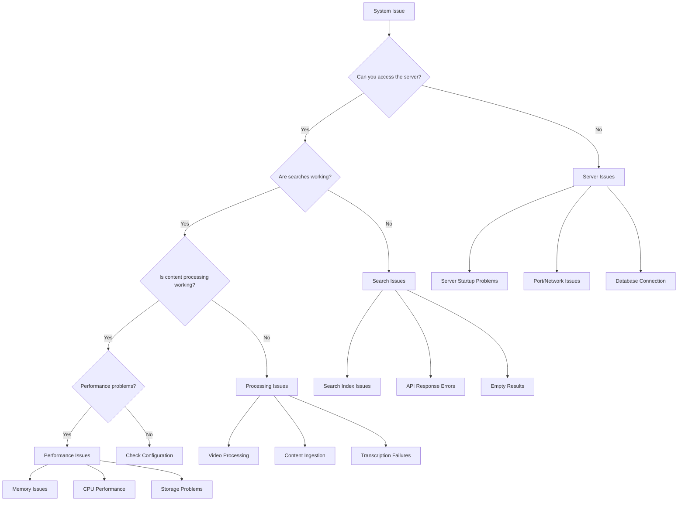
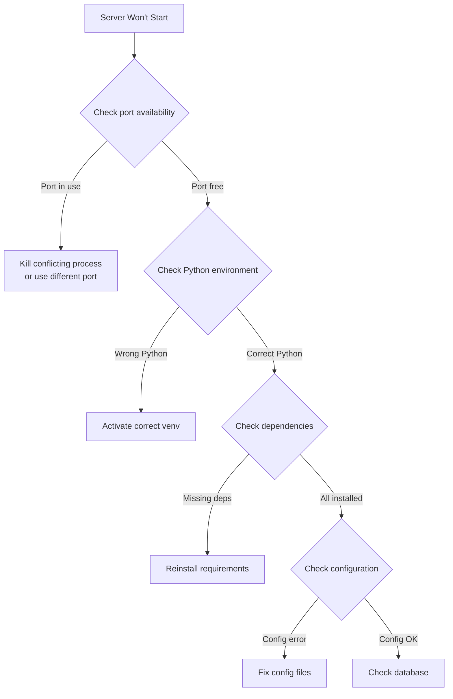
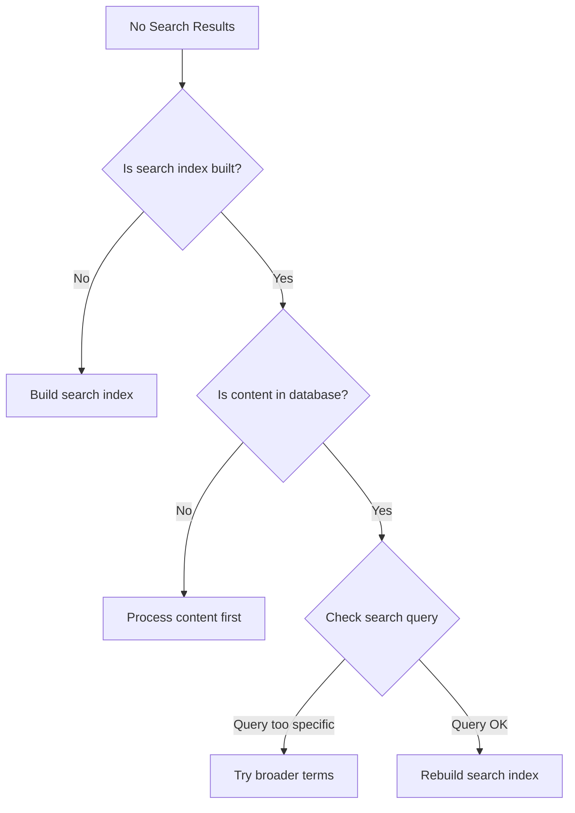
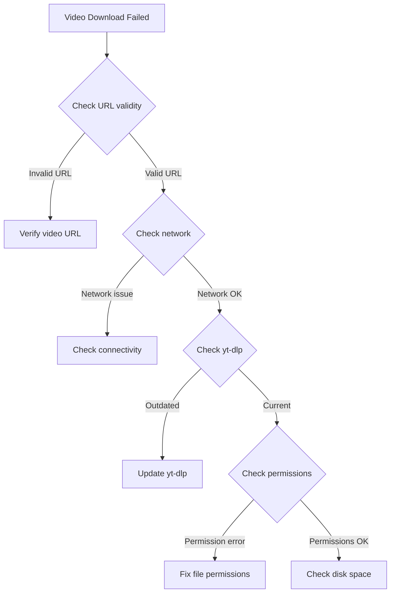
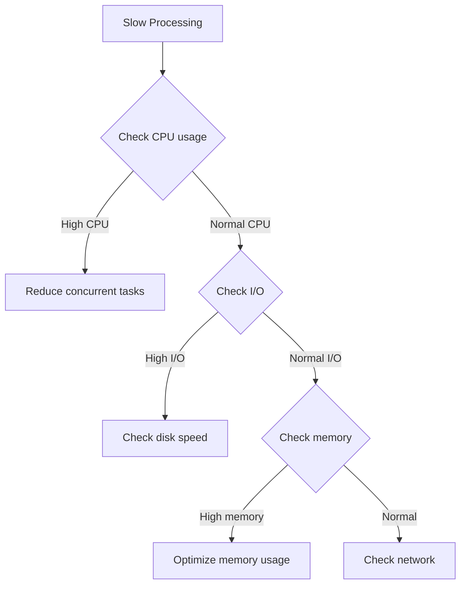

# Troubleshooting Guide

Comprehensive troubleshooting guide with decision trees and step-by-step
solutions.

## 🔍 Quick Diagnosis

Start here to identify your issue category:



## 🚨 Server Issues

### Server Won't Start

#### Symptoms

- `Connection refused` errors
- Server process doesn't start
- Port binding errors

#### Decision Tree



#### Step-by-Step Solutions

**1. Port Already in Use**

```bash
# Check what's using the port
lsof -i :8000
netstat -tulpn | grep :8000

# Kill the process
sudo kill -9 <PID>

# Or use a different port
export MCP_PORT=8080
python ai_knowledge_hub/enhanced_mcp_server.py
```

**2. Python Environment Issues**

```bash
# Verify Python version
python --version  # Should be 3.8+

# Check virtual environment
which python
# Should point to venv/bin/python

# Reactivate if needed
source venv/bin/activate
```

**3. Missing Dependencies**

```bash
# Reinstall all dependencies
pip install --upgrade -r requirements.txt

# Check for specific missing modules
python -c "import fastapi, sqlite3, numpy"

# Install system dependencies
# Ubuntu/Debian:
sudo apt install python3-dev python3-pip ffmpeg
# macOS:
brew install python ffmpeg
```

**4. Configuration Errors**

```bash
# Check configuration syntax
python -c "
import json
try:
    with open('ai_knowledge_hub/mcp_server_config.json') as f:
        config = json.load(f)
    print('Config is valid')
except Exception as e:
    print(f'Config error: {e}')
"

# Reset to default config
cp config/mcp_server_config.default.json ai_knowledge_hub/mcp_server_config.json
```

### Database Connection Issues

#### Symptoms

- Database locked errors
- SQLite connection failures
- Data not persisting

#### Solutions

**1. Database File Permissions**

```bash
# Check database file
ls -la ai_knowledge_hub/knowledge_hub.db

# Fix permissions
chmod 664 ai_knowledge_hub/knowledge_hub.db
chown $USER:$USER ai_knowledge_hub/knowledge_hub.db
```

**2. Database Corruption**

```bash
# Test database integrity
sqlite3 ai_knowledge_hub/knowledge_hub.db "PRAGMA integrity_check;"

# Backup and recreate if needed
mv ai_knowledge_hub/knowledge_hub.db ai_knowledge_hub/knowledge_hub.db.backup
python -m ai_knowledge_hub.setup --reset-db
```

**3. Multiple Connections**

```bash
# Check for stuck connections
lsof ai_knowledge_hub/knowledge_hub.db

# Kill processes if needed
ps aux | grep python | grep mcp_server
```

## 🔍 Search Issues

### No Search Results

#### Decision Tree



#### Solutions

**1. Missing Search Index**

```bash
# Check if index exists
ls -la ai_knowledge_hub/search_index/

# Build search index
python -c "
from ai_knowledge_hub import SearchIndexer
indexer = SearchIndexer()
indexer.build_indexes()
"
```

**2. Empty Database**

```bash
# Check database content
sqlite3 ai_knowledge_hub/knowledge_hub.db "SELECT COUNT(*) FROM content;"

# Process content
./run_complete_pipeline.sh run
```

**3. Search Query Issues**

```bash
# Test different query types
curl "http://localhost:8000/mcp/search?q=creatio"
curl "http://localhost:8000/mcp/search?q=installation&type=documentation"
```

### Search Performance Issues

#### Symptoms

- Slow search responses (>5 seconds)
- Memory spikes during search
- Search timeouts

#### Solutions

**1. Index Optimization**

```bash
# Rebuild optimized indexes
python -c "
from ai_knowledge_hub import SearchIndexer
indexer = SearchIndexer()
indexer.optimize_indexes()
"
```

**2. Memory Management**

```bash
# Check memory usage
ps aux | grep python | grep mcp_server

# Limit search results
curl "http://localhost:8000/mcp/search?q=creatio&limit=10"
```

## 🎥 Video Processing Issues

### Video Download Failures

#### Decision Tree



#### Solutions

**1. Update Video Downloader**

```bash
# Update yt-dlp
pip install --upgrade yt-dlp

# Test download directly
yt-dlp --version
yt-dlp "https://youtube.com/watch?v=VIDEO_ID" -F
```

**2. Network Connectivity**

```bash
# Test network
ping youtube.com
curl -I "https://youtube.com"

# Check proxy settings if needed
export https_proxy=http://proxy:port
```

**3. Storage and Permissions**

```bash
# Check disk space
df -h .

# Check directory permissions
ls -la videos/
chmod 755 videos/

# Create missing directories
mkdir -p videos/tech-hour/
```

### Transcription Failures

#### Symptoms

- Whisper fails to start
- Audio extraction errors
- Out of memory errors

#### Solutions

**1. Whisper Installation**

```bash
# Reinstall Whisper
pip uninstall openai-whisper
pip install openai-whisper

# Test Whisper directly
whisper --help
```

**2. Audio Extraction**

```bash
# Test ffmpeg
ffmpeg -version

# Extract audio manually
ffmpeg -i video.mp4 -vn -acodec pcm_s16le audio.wav
```

**3. Memory Management**

```bash
# Use smaller Whisper model
export WHISPER_MODEL=base

# Process shorter segments
python -c "
from transcription_processor import TranscriptionProcessor
processor = TranscriptionProcessor(chunk_length=30)
"
```

## ⚡ Performance Issues

### High Memory Usage

#### Diagnostic Commands

```bash
# Monitor memory usage
top -p $(pgrep -f mcp_server)
htop

# Check Python memory usage
python -c "
import psutil
process = psutil.Process()
print(f'Memory: {process.memory_info().rss / 1024 / 1024:.1f} MB')
"
```

#### Solutions

**1. Reduce Memory Footprint**

```bash
# Limit concurrent processes
export MAX_CONCURRENT_PROCESSES=1

# Use lighter models
export WHISPER_MODEL=tiny
export EMBEDDING_MODEL=sentence-transformers/all-MiniLM-L6-v2
```

**2. Optimize Database Queries**

```bash
# Add database indexes
sqlite3 ai_knowledge_hub/knowledge_hub.db "
CREATE INDEX IF NOT EXISTS idx_content_type ON content(type);
CREATE INDEX IF NOT EXISTS idx_content_source ON content(source);
"
```

### Slow Processing

#### Decision Tree



#### Solutions

**1. CPU Optimization**

```bash
# Check CPU cores
nproc

# Adjust concurrent processing
export MAX_WORKERS=$(nproc)
```

**2. Disk I/O Optimization**

```bash
# Check disk usage
iostat -x 1 5

# Move to SSD if possible
# Optimize SQLite for SSD
sqlite3 ai_knowledge_hub/knowledge_hub.db "PRAGMA journal_mode=WAL;"
```

## 🛠️ Configuration Issues

### Environment Variables

#### Check Current Configuration

```bash
# Display current environment
python -c "
import os
print('MCP_HOST:', os.getenv('MCP_HOST', 'localhost'))
print('MCP_PORT:', os.getenv('MCP_PORT', '8000'))
print('OPENAI_API_KEY:', 'Set' if os.getenv('OPENAI_API_KEY') else 'Not set')
"
```

#### Fix Common Issues

```bash
# Create .env file if missing
cat > .env << EOF
OPENAI_API_KEY=your_api_key_here
MCP_HOST=localhost
MCP_PORT=8000
WHISPER_MODEL=base
MAX_CONCURRENT_PROCESSES=2
EOF

# Load environment variables
source .env
```

### JSON Configuration Errors

#### Validate Configuration

```bash
# Check JSON syntax
python -m json.tool ai_knowledge_hub/mcp_server_config.json

# Reset to defaults if corrupted
cp config/defaults/mcp_server_config.json ai_knowledge_hub/
```

## 🔧 System Diagnostics

### Automated Diagnostic Script

```bash
#!/bin/bash
# save as diagnose.sh

echo "=== Creatio AI Knowledge Hub Diagnostics ==="

echo "1. Python Environment:"
python --version
which python

echo "2. Dependencies:"
pip list | grep -E "(fastapi|whisper|numpy|sqlite)"

echo "3. Ports:"
lsof -i :8000 -i :8001

echo "4. Database:"
ls -la ai_knowledge_hub/knowledge_hub.db

echo "5. Disk Space:"
df -h .

echo "6. Memory:"
free -h

echo "7. Server Test:"
curl -s http://localhost:8000/health || echo "Server not responding"

echo "=== End Diagnostics ==="
```

### Health Check Script

```python
#!/usr/bin/env python3
# save as health_check.py

import requests
import json
import sqlite3
import os

def check_server():
    try:
        response = requests.get('http://localhost:8000/health', timeout=5)
        return response.status_code == 200
    except:
        return False

def check_database():
    try:
        conn = sqlite3.connect('ai_knowledge_hub/knowledge_hub.db')
        cursor = conn.cursor()
        cursor.execute("SELECT COUNT(*) FROM sqlite_master WHERE type='table';")
        result = cursor.fetchone()
        conn.close()
        return result[0] > 0
    except:
        return False

def check_search():
    try:
        response = requests.get('http://localhost:8000/mcp/search?q=test', timeout=5)
        return response.status_code == 200
    except:
        return False

if __name__ == "__main__":
    print("Health Check Results:")
    print(f"Server: {'✅' if check_server() else '❌'}")
    print(f"Database: {'✅' if check_database() else '❌'}")
    print(f"Search: {'✅' if check_search() else '❌'}")
```

## 📞 Getting Additional Help

### Log Analysis

**Server Logs:**

```bash
tail -f logs/mcp_server.log
grep ERROR logs/mcp_server.log
```

**Processing Logs:**

```bash
tail -f logs/processing.log
grep -i "failed\|error" logs/processing.log
```

### Debug Mode

**Start server in debug mode:**

```bash
export DEBUG=1
python ai_knowledge_hub/enhanced_mcp_server.py
```

**Enable verbose logging:**

```bash
export LOG_LEVEL=DEBUG
python ai_knowledge_hub/enhanced_mcp_server.py
```

### Reset Everything

**Complete system reset:**

```bash
#!/bin/bash
# save as reset_system.sh

echo "Stopping all processes..."
pkill -f mcp_server

echo "Backing up data..."
mkdir -p backups/$(date +%Y%m%d_%H%M%S)
cp -r ai_knowledge_hub/knowledge_hub.db backups/$(date +%Y%m%d_%H%M%S)/ 2>/dev/null

echo "Cleaning up..."
rm -f ai_knowledge_hub/knowledge_hub.db
rm -rf ai_knowledge_hub/search_index/*
rm -rf logs/*

echo "Reinitializing..."
python -m ai_knowledge_hub.setup --reset-all

echo "System reset complete!"
```

---

## Common Error Messages

### `ModuleNotFoundError: No module named 'ai_knowledge_hub'`

**Solution:** Activate virtual environment and ensure you're in the project
directory

### `sqlite3.OperationalError: database is locked`

**Solution:** Close all connections and restart the server

### `ConnectionError: Connection refused`

**Solution:** Check if server is running and port is correct

### `FileNotFoundError: [Errno 2] No such file or directory: 'ffmpeg'`

**Solution:** Install ffmpeg system package

### `RuntimeError: Model 'large-v2' not found`

**Solution:** Use a smaller model like 'base' or ensure enough memory

---

**Still having issues?** Check the [FAQ](faq.md) or create an issue in the
repository.
